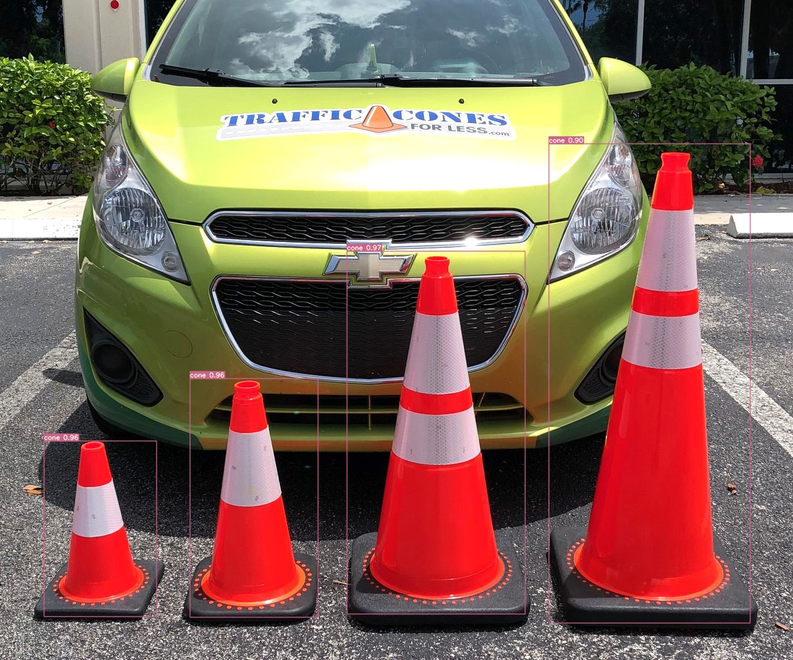
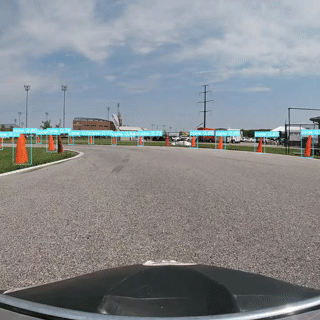

# Coneslayer

Coneslayer is a product of the Kennesaw State University's Electric Vehicle Team ([ksuevt.com](https://ksuevt.com)). This repository is licensed under the GPL-v3.0 license, see LICENSE for details

## Lightweight Orange Traffic Cone detection for autonomous vehicles

Coneslayer is a lightweight neural-network object detection model for rapid detection of orange traffic cones in static or dynamic scenes. Its design is based on [yolov7-tiny](https://github.com/WongKinYiu/yolov7/), a state of the art rapid object detection framework. Coneslayer is designed to run at at least 30fps live on edge devices, such as the Intel Movidius Myriad X VPU integrated in the Luxonis [OAK-D Pro](https://shop.luxonis.com/products/oak-d-pro) camera.





## Methodology

The core of coneslayer was trained on a set of over 10,000 hand-labeled images of homogeneous cones. About 2600 of these were generated automatically from GoPro footage then labeled by hand by members of the KSU EVT team:


| Person            | Images Labeled |
|-------------------|----------------|
| Brandon Solon     | 1171           |
| Toai Dong         | 502            |
| Hanson Chaney     | 491            |
| Matthew Krupczak  | 420            |
| Seth Canada       | 100            |
| Ethan Leitner     | 56             |
| Sahan Reddy       | 25             |
| Fernando Martinez | 11             |


Our own dataset was mixed at a 1 : 3 ratio with a customized subset of the [FSOCO dataset](https://www.fsoco-dataset.com/) containing just large and small orange traffic cones.

This resulted in a model that performed well on cones similar to those of the training set, but generalized poorly to complex scenes in the real world.

To remedy this issue, a series of transfer learning sessions were performed on a heterogeneous labeled dataset of about 800 items, with 500 images sourced from Google Search (from all over the world), screenshots of dashcam video from driving around Midtown Atlanta, and smartphone pictures of cones. An additional 300 images of complex scenes (from dashcam video) labeled as lacking traffic cones were used as negative training data.

## Usage

Clone WongKinYiu's [yolov7](https://github.com/WongKinYiu/yolov7/) repository and follow its installation instructions (an alternate install method is to use a python virtualenv instead of a container).

Place `coneslayer.pt` in your yolov7 directory. Run the command:
```bash
python3 detect.py --weights coneslayer.pt --conf 0.54 --iou 0.10 --img-size 416 --source ~/Path/To/Images
```

Alternatively, use one of the converted versions of the model, such as `coneslayer_openvino_2021.4_6shave.blob`, `coneslayer-simplified.onnx`, or `coneslayer.bin` created using [tools.luxonis.com](https://tools.luxonis.com). Usage as such may require an associated metadata file in either XML or JSON format.

## Demo


[](https://youtu.be/87J-y9KwT_8)

[](https://youtu.be/_5hygGPGBY8)

## Limitations

The architecture for coneslayer is based on yolov7-tiny, which has just over 6 million parameters. It is very small for a model of its kind, and its design sacrifices accuracy and specificity in favor of speed. Attempts have been made to make the model as specific as possible, however false positives will occur in complex scenes such as those encountered while driving. Do not use coneslayer in any safety-critical environment.

Coneslayer is not designed to detect non-conical traffic objects, such as traffic channelizers or barrels, or cones of a hue differing from orange.

## Acknowledgements

Ethan Leitner performed much of the prototyping and demonstrated a proof of concept based on yolov4-tiny. His experience was vital in switching to a yolov7-tiny based model.

Yonnas Alemu and Sahan Reddy [developed a tool](https://gitlab.com/KSU_EVT/autonomous-software/get-orange-cones) to obtain a subset of the FSOCO dataset. Brandon Solon labeled over 1000 images, with up to a dozen cones per image, by hand. These and other contributors' data were instrumental in building the core of coneslayer.

Dr. Lance Crimm advised our efforts and provided access to the Kennesaw State University's [High Performance Computer](https://research.kennesaw.edu/computing/index.php) which [was used](https://gitlab.com/KSU_EVT/autonomous-software/hpc_training_setup/) for numerous training sessions and iterations.

GitHub user [MarkDana](https://github.com/MarkDana) and their yolov4-based [RealtimeConeDetection](https://github.com/MarkDana/RealtimeConeDetection) repo served as inspiration for this project.
